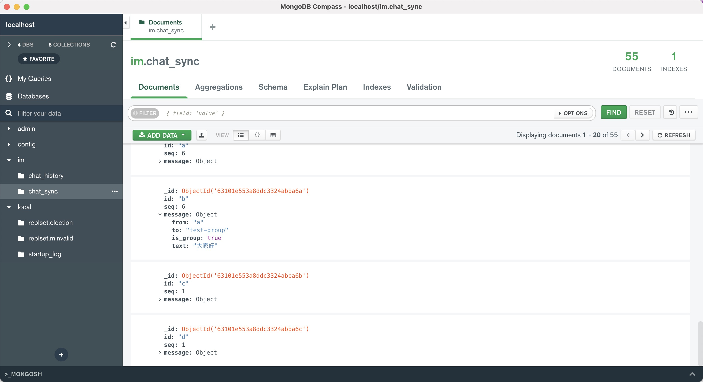

# go-timeline

a timeline(消息同步模型) service write by golang, thinks [aliyun tablestore](https://help.aliyun.com/document_detail/89885.html) !!!

depends:

- mongo: >= 5.0
- redis: >= 6.2

framework:

- [kratos](https://github.com/go-kratos/kratos)

## architecture

### data

mongodb主要有2个文档：

- `chat_sync`: 离线消息库（同步库），扩散写。一个消息写N份，当客户端成功拉取消息后，应删除离线消息，释放存储（目前为了调试方便，不会删除）
- `chat_history`: 持久化存储库（一般使用mysql，这里为了简单直接使用mongo实现），扩散读，一个消息只写一份。有2个作用：
  - 消息漫游。参考QQ消息漫游功能，可以任意查看几个月前，甚至一年前或者任意时间的历史消息。
  - web支持。因为web没有存储能力（无法缓存timeline同步位点），所以可以不用从 chat_sync 走同步流程，直接通过 chat_history 拉历史消息显示即可。

文档结构：

```go
type Message struct {
	Id      string                 `bson:"id,omitempty"`      // id，非mongo的对象id
	Seq     int64                  `bson:"seq,omitempty"`     // 连续递增序号
	Message map[string]interface{} `bson:"message,omitempty"` // 数据内容
}
```

- 离线消息库中：id代表收件人的id，具体的发送者信息、消息内容等需要自己解析Message，timeline服务并不限制存储的结构。
- 持久存储库：id代表会话（会话关系timeline不存储，需要上游服务自行实现），私聊的会话的id为：`samllUserId:bigUserId`，群聊会话的ID就是 `groupId`。故查询的时候，直接按照该规则查询即可。

### 消息序号生成

timeline 序号生成直接采用 redis 实现，保证同一个id下，seq严格递增即可（且连续）。

## example

### 场景

假设有如下聊天场景：

```text
a -> b: 吃了吗？
b -> a: 吃了

// group_a has member [a, b, c, d]

a -> group_a: 大家好
c -> group_a: 报三围
a -> group_a: 初次见面，多多指教
```

- a给b发送私聊消息
- b回复a
- a在群中发送一条消息
- c在群中发送一条消息
- a在群中发送一条消息

下面介绍主要接口实现。

### 发消息

[message_test.go: TestMessageUseCase_Send](internal/biz/message_test.go):

```go
var (
	user1, user2, user3, user4 = "a", "b", "c", "d"

	group       = "group_a"
)

assert.NoError(t, send(mc, "a", "b", "吃了吗？"))
assert.NoError(t, send(mc, "b", "a", "吃了"))

assert.NoError(t, sendGroup(mc, "a", "group_a", []string{"a", "c", "d"}, "大家好"))
assert.NoError(t, sendGroup(mc, "c", "group_a", []string{"a", "c", "d"}, "报三围"))
assert.NoError(t, sendGroup(mc, "a", "group_a", []string{"a", "c", "d"}, "初次见面，多多指教"))
```

### 同步消息（扩散写，存N份）

[message_test.go: TestMessageUseCase_GetSyncMessage](internal/biz/message_test.go):

```go
lastRead = 0
msgResult, err := mc.GetSyncMessage(context.Background(), user1, lastRead, math.MaxInt64)
```

- user1(a)

```bash
message_test.go:132: [seq=20] a -> b: 吃了吗？
message_test.go:132: [seq=21] b -> a: 吃了
message_test.go:132: [seq=22] a -> group_a: 大家好
message_test.go:132: [seq=23] c -> group_a: 报三围
message_test.go:132: [seq=24] a -> group_a: 初次见面，多多指教
```

- user2(b)

```bash
message_test.go:132: [seq=16] a -> b: 吃了吗？
message_test.go:132: [seq=17] b -> a: 吃了
```

- user3(c)

```bash
message_test.go:132: [seq=13] a -> group_a: 大家好
message_test.go:132: [seq=14] c -> group_a: 报三围
message_test.go:132: [seq=15] a -> group_a: 初次见面，多多指教
```

- user4(d)

```bash
message_test.go:132: [seq=13] a -> group_a: 大家好
message_test.go:132: [seq=14] c -> group_a: 报三围
message_test.go:132: [seq=15] a -> group_a: 初次见面，多多指教
```

### 查询历史消息（扩散读，只存一份）

- 单聊（[message_test.go: TestMessageUseCase_GetSingleHistoryMessage](internal/biz/message_test.go)）

```go
lastRead = 0
msgResult, err := mc.GetSingleHistoryMessage(context.Background(), "a", "b", lastRead, 10)
```

```bash
message_test.go:132: [seq=13] a -> b: 吃了吗？
message_test.go:132: [seq=14] b -> a: 吃了
```

- 群聊([message_test.go: TestMessageUseCase_GetGroupHistoryMessage](internal/biz/message_test.go))

```go
lastRead = 0
msgResult, err := mc.GetGroupHistoryMessage(context.Background(), "group_a", lastRead, 10)
```

```bash
message_test.go:132: [seq=22] a -> group_a: 大家好
message_test.go:132: [seq=23] c -> group_a: 报三围
message_test.go:132: [seq=24] a -> group_a: 初次见面，多多指教
```

## screenhost

### mongodb



### client

see [html client](./cmd/client/html/index.html): 


## api

### /timeline/send

request:

```bash
curl -X POST http://localhost:8000/timeline/send \
-H 'Content-Type:application/json' \
-d '{"from":"user_a","to":"user_b","message":"{\"from\": \"user_a\",\"to\":\"user_b\",\"text\":\"在吗？\"}"}'
````

```json
{
    "from":"user_a",
    "to":"user_b",
    "message":"{\"from\": \"user_a\",\"to\":\"user_b\",\"text\":\"在吗？\"}"
}
```

response:

```json
{"sequence":"3"}
```

### /timeline/sendGroup

request:

```bash
curl -X POST http://localhost:8000/timeline/sendGroup \
-H 'Content-Type:application/json' \
-d '{"group_name":"test_group","group_members":["user_a","user_b","user_c","user_d"],"message":"{\"from\":\"user_a\",\"to\":\"test_group\",\"is_group\":true,\"text\":\"大家好\"}"}'
```

```json
{
	"group_name": "test_group",
	"group_members": ["user_a", "user_b", "user_c", "user_d"],
	"message": "{\"from\":\"user_a\",\"to\":\"test_group\",\"is_group\":true,\"text\":\"大家好\"}"
}
```

response:

```bash
{"failedMembers":[]}
```

### /timeline/sync

request:

```bash
curl -X GET http://localhost:8000/timeline/sync?member=user_a&last_read=0&count=10
```

response:

```json
{
	"entrySet": [{
		"sequence": "3",
		"message": "{\"from\":\"user_a\",\"text\":\"在吗？\",\"to\":\"user_b\"}"
	}, {
		"sequence": "4",
		"message": "{\"from\":\"user_a\",\"is_group\":true,\"text\":\"大家好\",\"to\":\"test_group\"}"
	}]
}
```

### /timeline/history/single/{from}/{to}

request:

```bash
curl -X GET http://localhost:8000/timeline/history/single/user_a/user_b
```

response:

```json
{
	"entrySet": [{
		"sequence": "7",
		"message": "{\"from\":\"user_a\",\"text\":\"在吗？\",\"to\":\"user_b\"}"
	}]
}
```

### /timeline/history/group/{group}

request:

```bash
curl -X GET http://localhost:8000/timeline/history/group/test_group
```

response:

```json
{
	"entrySet": [{
		"sequence": "1",
		"message": "{\"from\":\"user_a\",\"is_group\":true,\"text\":\"大家好\",\"to\":\"test_group\"}"
	}]
}
```
